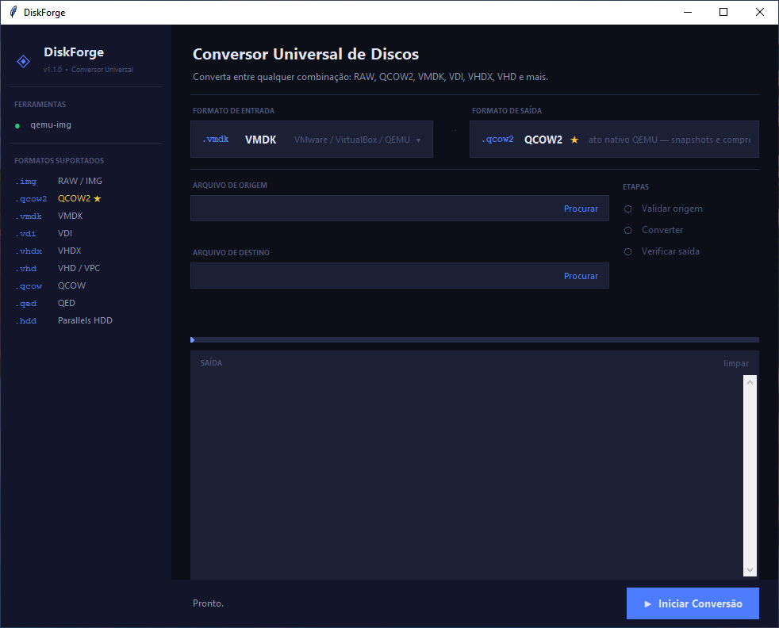

<div align="center">

# ◈ DiskForge

**Conversor universal de discos virtuais para Windows**

Converta discos entre qualquer combinação de formatos — RAW, QCOW2, VMDK, VDI, VHDX, VHD e mais — com interface gráfica profissional, sem linha de comando.

[](https://python.org)
[](https://microsoft.com/windows)
[](LICENSE)
[]()

</div>

---

## Índice

- [Sobre](#sobre)
- [Formatos suportados](#formatos-suportados)
- [Requisitos](#requisitos)
- [Instalação e uso](#instalação-e-uso)
- [Interface](#interface)
- [Como usar](#como-usar)
- [Usando os arquivos gerados](#usando-os-arquivos-gerados)
- [Arquitetura técnica](#arquitetura-técnica)
- [Solução de problemas](#solução-de-problemas)
- [Glossário](#glossário)
- [Licença](#licença)

---

## Sobre

DiskForge é uma ferramenta desktop para Windows que simplifica a migração de máquinas virtuais entre hypervisors. Ela envolve o motor padrão da indústria `qemu-img` em uma interface gráfica limpa, com conversor universal entre todos os formatos suportados, progresso em tempo real e log detalhado.

A aplicação é distribuída como **um único arquivo Python** com o `qemu-img` já embutido na pasta `tools/qemu/` — sem instalador, sem download de dependências, sem linha de comando.

---

## Formatos suportados

| Formato | Extensão | Hypervisor / Uso | Obs |
|---------|----------|-----------------|-----|
| **RAW / IMG** | `.img` | Universal — QEMU, VirtualBox, dd | Imagem setor a setor, bootável |
| **QCOW2** ⭐ | `.qcow2` | QEMU / KVM | Recomendado — suporta snapshots e compressão |
| **VMDK** | `.vmdk` | VMware, VirtualBox, QEMU | Formato mais compatível entre hypervisors |
| **VDI** | `.vdi` | VirtualBox | Formato nativo do Oracle VirtualBox |
| **VHDX** | `.vhdx` | Hyper-V (geração 2) | Microsoft — Windows Server / Azure |
| **VHD / VPC** | `.vhd` | Hyper-V legado / Virtual PC | Microsoft — sistemas mais antigos |
| **QCOW** | `.qcow` | QEMU (legado) | Versão 1 do formato QCOW |
| **QED** | `.qed` | QEMU (legado) | QEMU Enhanced Disk — descontinuado |
| **Parallels HDD** | `.hdd` | Parallels Desktop (Mac) | Migração de Parallels para outros hypervisors |

Qualquer combinação de entrada e saída é suportada. Por exemplo: VMDK → QCOW2, VDI → VHDX, RAW → VMDK, etc.

---

## Requisitos

| Componente | Versão |
|-----------|--------|
| Sistema operacional | Windows 10 ou 11 (64-bit) |
| Python | **Não necessário** (embutido no executável) |
| Conexão com internet | **Não necessária** |
| Espaço em disco | ~80-150 MB para o DiskForge.exe + tamanho da imagem gerada |

---

## Instalação e uso

### 1. Baixe o DiskForge

Baixe e extraia o `DiskForge-1.1.0-Windows.zip`. Dentro dele você encontrará:

```
DiskForge-1.1.0-Windows/
└── DiskForge.exe     ← Execute este arquivo!
```

### 2. Execute

Dê **duplo clique em `DiskForge.exe`**. Pronto! A janela abrirá imediatamente com a ferramenta pronta para uso.

Não requer:
- ❌ Instalar Python
- ❌ Abrir terminal
- ❌ Configurar nada
- ❌ Estar conectado à internet

**É só duplo clique!** 🚀

---

## Interface

```
┌──────────────┬─────────────────────────────────────────────────────┐
│              │  Conversor Universal de Discos                      │
│  ◈ DiskForge │  Converta entre qualquer combinação de formatos     │
│  v1.2.0      ├──────────────────────────────────────────────────── │
│              │  ┌──────────────────┐  →  ┌──────────────────────┐  │
│  FERRAMENTAS │  │ FORMATO ENTRADA  │     │   FORMATO DE SAÍDA   │  │
│  ● qemu-img  │  │  .vmdk  VMDK     │     │  .qcow2  QCOW2  ★    │  │
│              │  └──────────────────┘     └──────────────────────┘  │
│  FORMATOS    ├──────────────────────────────┬────────────────────── │
│  .img  RAW   │  Arquivo de Origem           │  ETAPAS              │
│  .qcow2 ★    │  Arquivo de Destino          │  ○ Validar origem    │
│  .vmdk       │                              │  ◉ Converter         │
│  .vdi        ├──────────────────────────────┴────────────────────── │
│  .vhdx       │  47.3%     Decorrido: 23s          ETA: 31s         │
│  .vhd        │  ████████████░░░░░░░░░░░░░░░░░░░░░░░░░░░░░          │
│  .qcow       ├─────────────────────────────────────────────────────│
│  .qed        │  SAÍDA                                     limpar   │
│  .hdd        │  [14:23:39] ℹ Iniciando: VMDK → QCOW2              │
│              │  [14:23:54] ✓ Arquivo gerado (30.0 GB)              │
├──────────────┴─────────────────────────────────────────────────────┤
│  Pronto.                               ▶ Iniciar Conversão         │
└────────────────────────────────────────────────────────────────────┘
```


### Seletor de formato

Clique no card de **FORMATO DE ENTRADA** ou **FORMATO DE SAÍDA** para abrir o menu dropdown com todos os formatos disponíveis. Cada opção mostra a extensão, o nome do formato e uma breve descrição. O QCOW2 é marcado com ★ como formato recomendado para uso com QEMU/KVM.

### Sidebar

Exibe o status do `qemu-img` (● verde = pronto, ✕ vermelho = não encontrado) e a lista de todos os formatos suportados.

### Barra de progresso

Mostra percentual, tempo decorrido e ETA calculados a partir do throughput atual.

### Log de saída

Cada linha tem timestamp e ícone:

| Ícone | Tipo | Significado |
|-------|------|-------------|
| `ℹ` | info | Mensagens de status |
| `✓` | ok | Confirmações de sucesso |
| `⚠` | warn | Avisos não fatais |
| `✗` | error | Erros que interromperam a operação |
| `·` | log | Saída bruta do qemu-img |

---

## Como usar

1. **Selecione o formato de entrada** clicando no card "FORMATO DE ENTRADA" e escolhendo o formato do seu arquivo de origem.

2. **Selecione o formato de saída** clicando no card "FORMATO DE SAÍDA" e escolhendo o formato desejado.

3. **Selecione o arquivo de origem** clicando em *Procurar* no campo "Arquivo de Origem". O tamanho do arquivo será exibido abaixo.

4. **Confirme o destino** — o caminho de saída é sugerido automaticamente com o sufixo `_converted` e a extensão correta. Pode ser alterado manualmente.

5. **Clique em ▶ Iniciar Conversão** e acompanhe o progresso em tempo real.

> **Nota:** Não é possível converter um formato para ele mesmo. Se os formatos de entrada e saída forem iguais, o DiskForge avisará antes de iniciar.

---

## Usando os arquivos gerados

### Importar QCOW2 no QEMU/KVM

```bash
virt-install --disk path=disco.qcow2,format=qcow2 ...
# ou simplesmente especifique o arquivo ao criar a VM no virt-manager
```

### Importar VMDK no VMware

Crie uma nova VM no VMware Workstation ou Player. Quando solicitado a selecionar um disco, escolha **"Use an existing virtual disk"** e selecione o `.vmdk` gerado.

### Inicializar `.img` diretamente com QEMU

```bash
qemu-system-x86_64 -hda disco_converted.img -m 2048 -enable-kvm
```

### Converter RAW de volta para VDI (VirtualBox)

```powershell
VBoxManage convertfromraw "disco.img" "disco.vdi" --format VDI
```

---

## Arquitetura técnica

### Stack

| Camada | Tecnologia |
|--------|-----------|
| Distribuição | `PyInstaller 6.x` — Executável Windows compilado, autocontido |
| Interface gráfica | `tkinter` (stdlib Python) — widgets customizados com `Canvas` e `Toplevel` |
| Motor de conversão | `qemu-img` embutido no executável |
| Threading | `threading.Thread` — conversão em thread separada; polling via `Tk.after(80ms)` |
| Comunicação entre threads | `queue.Queue` — passagem de mensagens thread-safe |
| Controle de processos | `subprocess.Popen` com `CREATE_NO_WINDOW`; stdout lido linha a linha |
| HiDPI | `SetProcessDpiAwareness(1)` via `ctypes.windll.shcore` |

### Comando executado

Para qualquer conversão de formato A para formato B:

```
qemu-img convert -p -f <formato_entrada> -O <formato_saída> <origem> <destino>
```

### Parsing de progresso

```python
re.search(r"\((\d+(?:\.\d+)?)/100%\)", line)
```

O ETA é calculado a partir do tempo decorrido e do percentual atual:

```python
total_estimado = tempo_decorrido / (pct / 100)
eta = total_estimado - tempo_decorrido
```

---

## Solução de problemas

### Não consigo executar o arquivo

- Verifique se é realmente `DiskForge.exe` (e não `DiskForge.spec` ou outro arquivo)
- Tente clicar com botão direito → "Executar como administrador"
- Verifique se não foi bloqueado (clique direito → Propriedades → Desbloquear)

### Antivírus bloqueia o arquivo

PyInstaller às vezes causa falsos positivos em antivírus. Isso é normal. Você pode:
1. Adicionar uma exclusão para `DiskForge.exe` no seu antivírus
2. Reportar o arquivo ao fabricante do antivírus como falso positivo

### Conversão falha ou não inicia

Verifique se você tem espaço em disco suficiente para a imagem de saída. Uma conversão de disco de 100 GB precisa de 100+ GB livres no disco.

### Arquivo de saída maior que o esperado

Imagens RAW sempre têm o tamanho total do disco virtual, independente do espaço realmente usado. Um disco de 100 GB com 10 GB de dados gera um `.img` de 100 GB. Use QCOW2 para obter compressão automática.

---

## Glossário

| Termo | Definição |
|-------|-----------|
| **RAW / IMG** | Cópia setor a setor de um disco. Contém tabela de partições, bootloader e todos os dados. Sem compressão. Compatível universalmente. |
| **QCOW2** | Formato nativo do QEMU com suporte a snapshots, compressão e alocação dinâmica. Recomendado para uso com QEMU/KVM. |
| **VMDK** | Virtual Machine Disk — formato de disco usado pelo VMware e amplamente suportado. |
| **VDI** | VirtualBox Disk Image — formato nativo do Oracle VirtualBox. |
| **VHDX** | Virtual Hard Disk v2 — formato moderno da Microsoft para Hyper-V. |
| **VHD / VPC** | Virtual Hard Disk legado da Microsoft — compatível com Hyper-V e Azure. |
| **qemu-img** | Ferramenta de linha de comando do projeto QEMU para criar, converter e inspecionar imagens de disco. Suporta 40+ formatos. |
| **Imagem inicializável** | Imagem que contém tabela de partições, MBR/GPT e bootloader — pode ser usada como disco de boot. |
| **HiDPI** | Displays de alta densidade de pixels (ex: 4K). O DiskForge declara suporte a DPI para renderização nítida. |

---

## Licença

Este projeto está licenciado sob a **Licença MIT** — veja o arquivo [LICENSE](LICENSE) para detalhes.

> **Nota sobre dependências:** O `qemu-img` é distribuído sob a [GNU General Public License v2](https://www.gnu.org/licenses/old-licenses/gpl-2.0.html). O DiskForge distribui o binário `qemu-img.exe` junto ao pacote. O código-fonte do QEMU está disponível em [qemu.org](https://www.qemu.org). O DiskForge não modifica nem incorpora o código-fonte do QEMU.

---

<div align="center">

Feito com Python e tkinter · Motor de conversão: [QEMU](https://www.qemu.org/) · Build Windows: [Stefan Weil](https://qemu.weilnetz.de)

</div>
